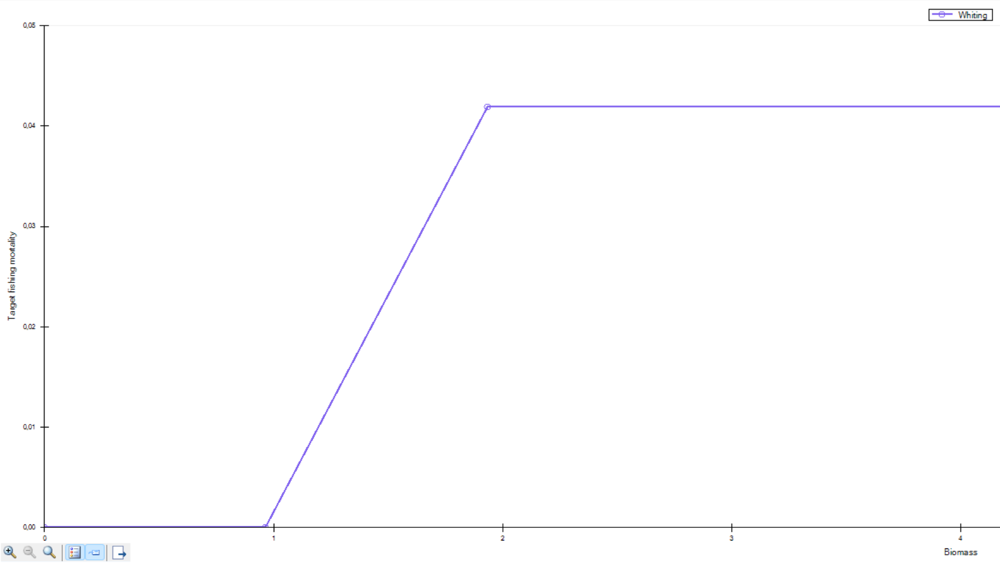
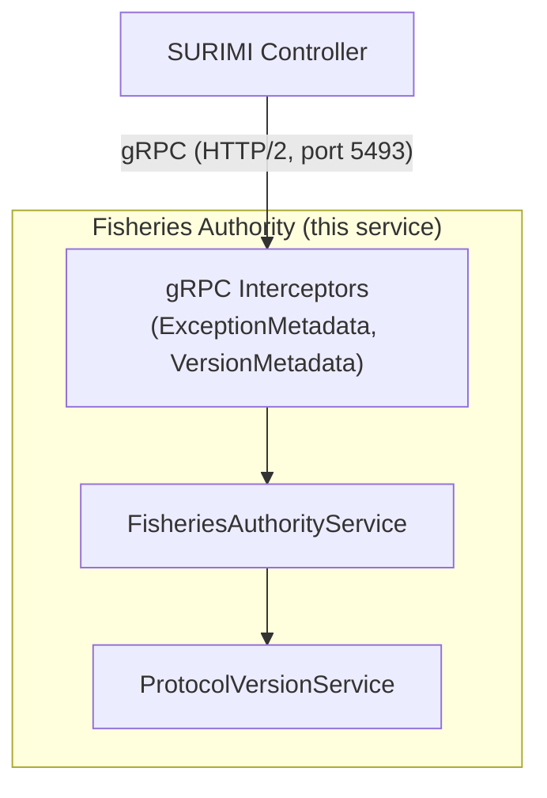
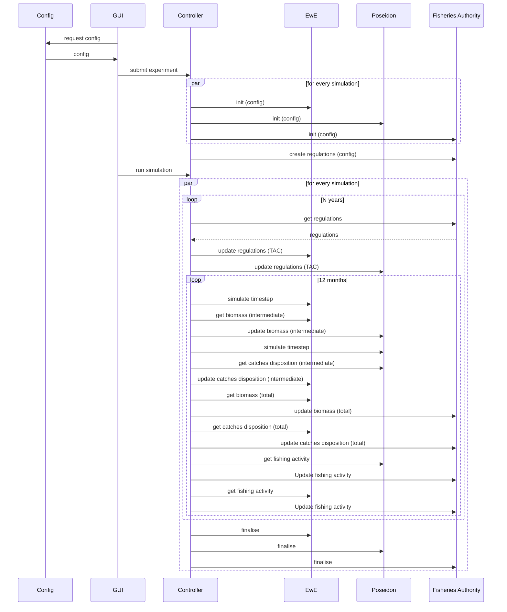

# Fisheries Authority — Architecture

## Overview

The **Fisheries Authority** model is a component of the **SURIMI** (Sustainable Use of Resources through Integrated Marine modelling Infrastructure) simulation framework. SURIMI is a multi-model system that simulates marine fisheries ecosystems. All models — including this one — communicate exclusively with the **SURIMI Controller** over **gRPC**, using a shared Protobuf-based protocol (`BSR.Surimi.Surimi-Protocol`).

The Fisheries Authority model represents the regulatory authority in the simulation. It provides fishing regulations (Total Allowable Catches) to other models and receives updates on biomass, catch dispositions, and fishing activity from the Controller, which aggregates data from the ecology and fleet models.

The service is written in **C# (.NET 10)** and developed with **Microsoft Visual Studio Professional 2026**. It is built as an ASP.NET Core gRPC server.

### Licence

The code is licensed under the **GNU General Public License v3.0 (GPL-3.0)**. See `LICENSE.txt` in the repository root.

---

## Responsibilities

- Provide **fishing regulations** (Total Allowable Catches per species and fleet segment) to the Controller at the start of each simulation year.
- Receive and process **biomass updates** from the Controller (originating from the ecology model).
- Receive and process **catch disposition updates** from the Controller (originating from the ecology and fleet models).
- Receive and process **fishing activity updates** from the Controller (originating from ecology and fleet models).
- Accept **regulation definitions** from the Controller at the start of a simulation run.
- Manage simulation **lifecycle** events: initialise, run steps, finalise, and cancel.
- Report its **protocol version** for compatibility checking.

### Build outputs

| Binary | Description |
|--------|-------------|
| `SURIMI-fisheries-authority` | ASP.NET Core gRPC server. Hosts the `FisheriesAuthorityService` and exposes it on port `5493`. |

---

## Interfaces

### Lifecycle messages (gRPC — received from Controller)

| Message | Direction | Description |
|---------|-----------|-------------|
| `InitialiseSimulation` | Controller → FA | Initialises a new simulation; receives full simulation configuration and scenario name. |
| `CreateRegulations` | Controller → FA | Provides regulation definitions at the start of a simulation run. |
| `FinaliseSimulation` | Controller → FA | Signals that the simulation has completed normally. |
| `CancelSimulation` | Controller → FA | Signals that the simulation has been cancelled. |
| `GetProtocolVersion` | Controller → FA | Queries the protocol version for compatibility verification. |

### Operational messages (gRPC — received from Controller)

| Message | Direction | Description |
|---------|-----------|-------------|
| `GetRegulations` | Controller → FA | Requests the current regulations (TACs) for a given time window; called at the start of each simulation year. |
| `UpdateBiomass` | Controller → FA | Delivers biomass data (from ecology model) for the current time step. |
| `UpdateCatchDisposition` | Controller → FA | Delivers catch disposition data (from ecology/fleet models) for the current time step. |
| `UpdateFishingActivity` | Controller → FA | Delivers fishing activity data (from ecology/fleet models) for the current time step. |

---

## Model theory


The Fisheries Authority represents the **governmental regulatory body** responsible for setting fishing quotas. In real-world fisheries management, authorities issue **Total Allowable Catches (TACs)** — upper bounds on the quantity of each species that may be caught by each fleet segment over a defined period (typically annually). By receiving biomass and catch data from the ecosystem and fleet models, the Fisheries Authority can, in principle, dynamically adjust regulations in response to the simulated ecological state, reflecting adaptive management principles.


### Target Fishing Mortality

The "Hockey stick" refers to the shape of the Target Fishing Mortality curve as a function of estimated biomass — it looks like a hockey stick lying on its side.

Looking at the formula in UpdateQuotas (the Target Fishing Mortality branch):

`FTarget = Fopt * (Bestimate - Blim) / (Bbase - Blim)   clamped to [Fmin, Fopt]`

Plotting FTarget against Bestimate gives three segments:

```text
FTarget|
  Fopt |          --------------   ← flat blade (clamped at Fopt)
       |         /
       |        /
       |       /                 ← sloped shaft (linear ramp)
Fmin   |------/
       |---------------------  Bestimate
           Blim     Bbase
```

* Below Blim (biomass limit): FTarget is clamped down to Fmin (often 0) — the flat handle end. Fishing is throttled to protect a depleted stock.
* Between Blim and Bbase: FTarget ramps up linearly with biomass — the sloped shaft.
* At or above Bbase (the base/target biomass): FTarget is clamped to Fopt, the optimal fishing mortality — the flat blade.
This is a common harvest control rule in fisheries management: fish hard when the stock is healthy, ramp down proportionally as it declines, and stop when it drops below the limit.


### Harvest control Rules
With a harvest control rule, the Fisheries Authority can implement a feedback mechanism that adjusts TACs based on observed biomass levels. For example, if the biomass of a particular species falls below a predefined threshold, the harvest control rule may reduce the TAC for that species to prevent overfishing. Conversely, if biomass is above the threshold, the TAC may be increased to allow for sustainable harvesting.



In the example above, when the Biomass of Whiting drops below 1 tonne per year, all fishing is prohibited (TAC = 0). When the Biomass is 1,5 tonnes per year, about 2,5 % of the biomass can be caught. When the biomass of Whiting is more than 2 tonnes per year, the target fishing mortality is around 5%, so the TAC is 2 * 0.05 = 0.1 Tonnes.

### MSE options
The MSE options that are used in SURIMI are the "output (quota) controls". 

(Fishing effort control means that the effort of a fleet is controlled by restricting the number of days at sea, or the number of vessels allowed to fish, or the amount of gear that can be used. This is not implemented in SURIMI.)
    


---

## Service architecture

The Fisheries Authority is a stateless gRPC microservice that acts as a **regulatory data provider and catch monitor** within the SURIMI simulation loop. It is built on ASP.NET Core's gRPC server framework and exposes a single service class (`FisheriesAuthorityService`) that overrides the generated base from the shared Surimi Protocol. The service is registered as a singleton and uses ASP.NET Core's built-in dependency injection for logging and versioning. All gRPC calls pass through two interceptors: `ExceptionMetadataInterceptor` (which enriches error responses) and `VersionMetadataInterceptor` (which attaches protocol version metadata to responses). Configuration is minimal and driven by environment variables and `appsettings.json`.

### High-Level Architecture



### Message flow

The sequence below shows how the SURIMI Controller interacts with the Fisheries Authority during a complete simulation run.




> **Cancellation path:** If the simulation is cancelled, the Controller calls `CancelSimulation` instead of `FinaliseSimulation`.

### Key design decisions / trade-offs

- **Stateless server:** The service does not maintain per-simulation state internally; all relevant context is passed in each request. This simplifies horizontal scaling.
- **Shared protocol package:** The gRPC contracts are defined in the `BSR.Surimi.Surimi-Protocol` NuGet package (hosted on Buf Schema Registry), ensuring all models share the same Protobuf definitions without per-repo duplication.
- **Internal domain model mapping:** The service maps the gRPC `Simulation` message to the internal `SURIMI.Datamodel.SurimiContract` type in `GetSurimiContract()`, decoupling the transport layer from domain logic.
- **Hardcoded TAC stub:** `GetRegulations` currently returns a hardcoded list of TACs (PIL/ART/ESP and KHE/OTB/ESP). This is a placeholder until a real data source (e.g., S3 bucket or database) is connected.
- **Large message size:** The gRPC message size limit is set to 100 MB (send and receive) to accommodate large biomass and catch disposition payloads.

---

## Error handling

All unhandled exceptions propagate through the `ExceptionMetadataInterceptor`, which enriches the gRPC error response with structured metadata before returning it to the Controller. Within each service method, exceptions are caught, logged with `LogError`, and re-thrown so the interceptor can handle them consistently. The Controller is responsible for deciding whether to cancel or abort the simulation upon receiving a gRPC error.

---

## Logging

Logging is configured in `Program.cs` using ASP.NET Core's built-in logging infrastructure:

- All default providers are cleared.
- `SimpleConsole` is added with a timestamp format of `[HH:mm:ss]`.
- Log levels are controlled by `appsettings.json`: `Default = Information`, `Microsoft.AspNetCore = Warning`, `Microsoft.AspNetCore.Hosting = Information`.
- Each gRPC method logs an informational message on entry (e.g., `Received GetRegulations request for simulation {SimulationId}`).
- Errors are logged with `LogError` including the exception object for stack trace capture.
- The protocol version is logged at startup.

---

## S3 bucket

The Fisheries Authority model currently does **not** read from or write to an EDITO S3 bucket. Future versions are expected to load regulation definitions (TACs, species lists, fleet segments) from S3 as scenario input data, replacing the current hardcoded stubs.

### S3 bucket authentication

When S3 access is implemented, authentication will follow the SURIMI platform pattern:
- Long-lived credentials (access key / secret) are stored securely in a **Vault** instance managed by the EDITO Datalab.
- At runtime, the service retrieves the credentials from Vault using a short-lived service token.
- The retrieved credentials are used to authenticate with the S3 bucket for the duration of the simulation.

---

## Kubernetes

The Fisheries Authority service is designed to be deployed in the **EDITO Datalab Kubernetes cluster**. The Docker image is based on `mcr.microsoft.com/dotnet/aspnet:10.0` and targets Linux containers (`DockerDefaultTargetOS=Linux`). The service listens on port `5493` (HTTP/2 for gRPC). In Kubernetes, it will be exposed as a ClusterIP service reachable only by the SURIMI Controller pod(s).

---

## Environment

| Variable | Description |
|----------|-------------|
| `ASPNETCORE_HTTP_PORTS` | Port the ASP.NET Core server listens on. Defaults to `5493` as set in the Dockerfile. |
| `OTEL_EXPORTER_OTLP_ENDPOINT` | Endpoint for OpenTelemetry OTLP exporter (e.g. `http://localhost:4317`). Used for telemetry/tracing export. |
| `OTEL_SERVICE_NAME` | Service name reported to the OpenTelemetry collector. Set to `ValueChain` in the Dockerfile. |

> Standard ASP.NET Core environment variables such as `ASPNETCORE_ENVIRONMENT` also apply.

---

## CI/CD

Two GitHub Actions workflows are defined:

### `build-check.yml` — Build Check (on pull request to `master`)

Triggered on every pull request targeting `master`. Uses the reusable action `Official-EwE/Eii.GithubActions/BuildCheckUbuntuBSR@master`, which performs a NuGet restore (with BSR token for the Buf Schema Registry) and a dotnet build to verify the code compiles before merging.

### `docker.yml` — Build and Push Docker Image (on push to `master`)

Triggered on every push to `master`. Steps:
1. Checks out the repository.
2. Logs in to the **GitHub Container Registry (GHCR)** using `GITHUB_TOKEN`.
3. Builds the Docker image using `SURIMI-fisheries-authority/Dockerfile`, injecting `GITHUB_TOKEN` (for GitHub Packages NuGet feed) and `BSR_TOKEN` (for Buf Schema Registry) as BuildKit secrets.
4. Pushes the image to: **`ghcr.io/official-ewe/surimifisheriesauthority:latest`**

---

## Technology stack

| Package | Version | Role |
|---------|---------|------|
| `Grpc.AspNetCore` | 2.71.0 | ASP.NET Core gRPC server hosting |
| `Grpc.StatusProto` | 2.71.0 | Rich gRPC error status with Protobuf details |
| `Google.Api.CommonProtos` | 2.17.0 | Common Google API Protobuf types (used in protocol definitions) |
| `BSR.Surimi.Surimi-Protocol.Grpc.Csharp` | 1.82.10101.83 | Generated C# gRPC client/server stubs and Protobuf messages for the SURIMI protocol (from Buf Schema Registry) |
| `SURIMI.Common` | 1.0.* | Shared SURIMI utilities: `ProtocolVersionService`, gRPC interceptors (`ExceptionMetadataInterceptor`, `VersionMetadataInterceptor`), `GrpcValidation` |
| `SURIMI.Datamodel` | 3.0.* | Shared SURIMI domain model types (e.g. `SurimiContract`, `TotalAllowableCatch`, `Species`, `FleetSegment`) |
| `Microsoft.VisualStudio.Azure.Containers.Tools.Targets` | 1.22.1 | Visual Studio Docker integration for container debugging |

---

## Project Structure

```
SURIMI-fisheries-authority/          ← Repository root
├── .github/
│   └── workflows/
│       ├── build-check.yml          ← PR build verification workflow
│       └── docker.yml               ← Docker build and push workflow
├── SURIMI-fisheries-authority/      ← Main project
│   ├── Services/
│   │   └── FisheriesAuthorityService.cs  ← gRPC service implementation
│   ├── Properties/
│   │   └── launchSettings.json      ← Local launch profiles
│   ├── Program.cs                   ← Application entry point, DI setup
│   ├── appsettings.json             ← Logging and Kestrel configuration
│   ├── appsettings.Development.json ← Development overrides
│   ├── Dockerfile                   ← Multi-stage Docker build
│   ├── .dockerignore
│   └── SURIMI-fisheries-authority.csproj
├── .editorconfig
├── SURIMI-fisheries-authority.sln
├── README.md
├── LICENSE.txt
└── fisheries-authority_architecture.md  ← This document
```

---

## Source control

The project uses **Git**, hosted on **GitHub** at [`Official-EwE/SURIMI-fisheries-authority`](https://github.com/Official-EwE/SURIMI-fisheries-authority).

Notable points:
- The `BSR.Surimi.Surimi-Protocol.Grpc.Csharp` package is consumed from the **Buf Schema Registry (BSR)** NuGet feed (`https://buf.build/gen/nuget/index.json`), requiring a `BSR_TOKEN` secret in CI and in local NuGet configuration.
- The `SURIMI.Common` and `SURIMI.Datamodel` packages are consumed from the **GitHub Packages** NuGet feed (`https://nuget.pkg.github.com/Official-EwE/index.json`), requiring a `GITHUB_TOKEN`.
- There are no Git submodules. Protocol definitions are versioned independently via the BSR NuGet package.

---

## Testing

### Automated tests

There are currently no automated unit or integration tests in this repository. The build check CI workflow verifies that the project compiles successfully on every pull request.

### Manual testing with Postman

The gRPC service can be tested manually using **Postman** (or any gRPC client such as `grpcurl`):

1. Start the service locally (the default port is `5493`).
2. Import the Surimi Protobuf definitions from the BSR package (or point Postman to the running server's reflection endpoint if enabled).
3. Send requests to the available RPC methods, e.g.:
   - `GetProtocolVersion` — verify the service is running and check the protocol version.
   - `InitialiseSimulation` — provide a `SimulationId`, `ScenarioName`, and a `Simulation` message body.
   - `GetRegulations` — provide a `SimulationId`, `StartDateTime`, and `EndDateTime`; verify the hardcoded TAC response is returned.
   - `UpdateBiomass`, `UpdateCatchDisposition`, `UpdateFishingActivity` — send sample payloads and verify the echo response.
